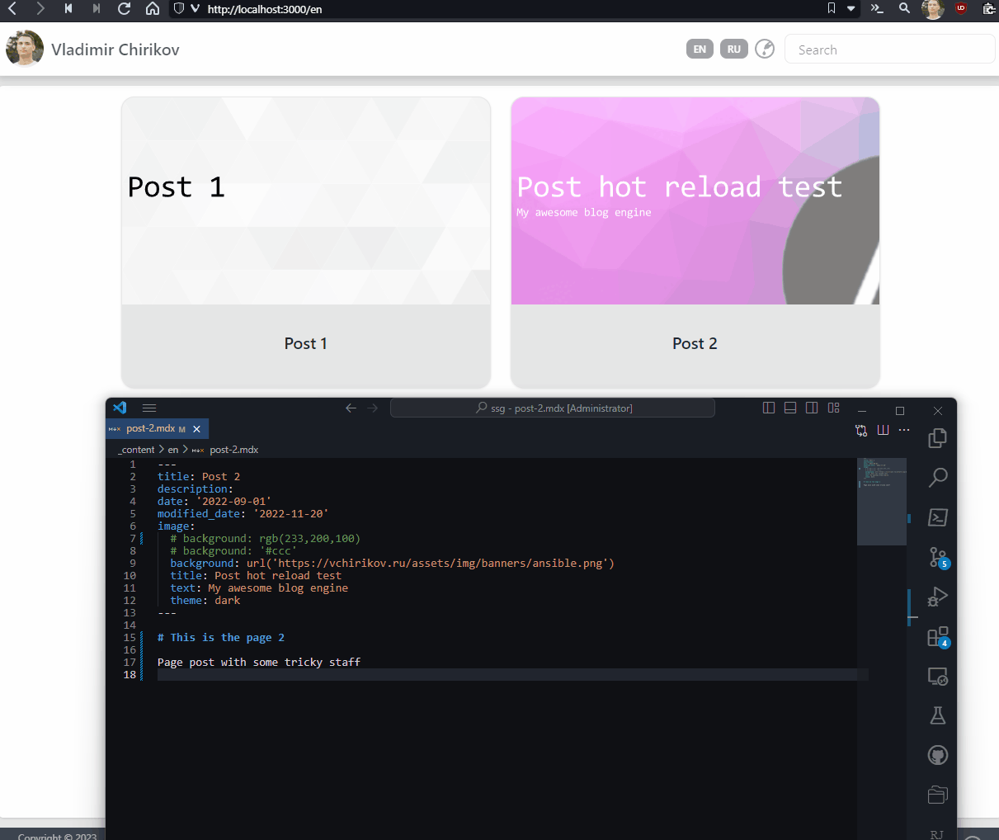

# vite-plugin-ssr-solidjs-blog-example



This is an example, which I did before migrating of [my homepage](https://vchirikov.github.io) from nextjs to
[vite-plugin-ssr](https://vite-plugin-ssr.com) + solidjs. The example is fully SSG compatible, including image generation and full-text search.

The example uses:

* [stork](https://github.com/jameslittle230/stork) as file search engine (wasm)
* [satori](https://github.com/vercel/satori/) to generate post images & opengraph images from frontmatter (at build-time with vite hot reload)
* [mdx-js/mdx](https://github.com/mdx-js/mdx/) to support components in markdown (but I don't use `@mdx-js/rollup`, instead, use my own implementation to copy referenced images/files to assets from .md/.mdx)
* [typesafe-i18n](https://github.com/ivanhofer/typesafe-i18n) to work with i18n
* [prismjs](https://prismjs.com) to work with code blocks inside md/mdx
* [postcss](https://postcss.org/) + [tailwindcss](https://tailwindcss.com) & [daisyui](https://daisyui.com) for theming & css
* [vitest](https://vitest.dev/) for testing (unit + [@solidjs/testing-library](https://github.com/solidjs/solid-testing-library) for component testing)
* and many more...

## Developing

> **Warning**
> before publishing/preview you should set `servedUrl` env variable to the full url of the app (for opengraph images it's matter & in other places)

> **Warning**
> We cache typesafe-i18n locale at first run and don't reload locale all the time, thus if you add a new
> translate function. restart `pnpm dev` (`vite dev`) to reload locale at nodejs.

> **Note**
> If you just want to test the example you don't need stork, just use `build:vite` script


## Requirements

* nodejs according to [`.nvmrc`](./.nvmrc)

* [pnpm](https://pnpm.io/installation#using-corepack)
  ```sh
  cd ~
  corepack enable
  corepack prepare pnpm@latest --activate
  # check the path
  pnpm store path
  # time-to-time use prune to cleanup old packages
  pnpm store prune
  ```
* [stork](https://github.com/jameslittle230/stork)
  ```sh
  # if you don't have rust go to https://rustup.rs or download from release page
  cargo install stork-search --locked
  ```


### Suffixes

There are four page file suffixes:
* `page.js`: runs in the browser as well as in Node.js
* `page.client.js`: runs only in the browser
* `page.server.js`: runs only in Node.js
* `page.route.js`: defines the page's Route String or Route Function.

---


# Testing

`tests/unit` - unit test for services
`tests/components` - test for components
`tests/e2e` - e2e tests with playwright

To write test use:
* [vitest](https://vitest.dev/api/expect.html)
* [testing-library/jest-dom](https://github.com/testing-library/jest-dom#table-of-contents)  
* [happy-dom](https://github.com/capricorn86/happy-dom)  
* [@solidjs/testing-library](https://github.com/solidjs/solid-testing-library)
* [Testing Library API](https://testing-library.com/docs/queries/about)  

It's VERY important to use lambdas where you want to use JSX, only functions will be translated with solidjs,
in other case this JSX will be rendered as static without any context and so on.


### Debugging vite-plugin-ssr

```ps1
# To debug assets injecting
$env:DEBUG='vps:extractAssets'
pnpm build
# output: `dist/client/manifest.json`
```

### Pre-rendering

1. collect page infos
2. exclude pages with export of `doNotPrerender`
3. call exported `prerender()` in `*.page.server.ts` files -> normalize to `{url, pageContext}[]`, so it's create a list of urls
4. collect page routes from `*.page.route.ts` -> call `onBeforeRoute` with urls collected here ^^
5. call `onBeforePrerender` from `_default.page.server.ts`
6. call `routeAndPrerender()`
    - route part
      * parses url from route function
      * calls `onBeforeRoute(pageContext)` which could return 
        - `_pageId` (should be in `allPageIds` (it's path without `fileType` suffix))
        - `routeParams`
        - `urlOriginal`
      * adds  `_urlPristine` == urlOriginal if `onBeforeRoute` overrides `urlOriginal`
    - render part
      * call `OnBeforeRender()`
      * call `render()` -> get html from && serialize `pageContext`
7. call `prerender404()`
8. foreach `writeHtmlFile(htmlFile & serializedPageContext)`
  * converts `urlOriginal` as a path via `urlToFile()`
  * calls `onPagePrerender(pageContext & _prerenderResult: { filePath, fileContent })` if any or write the file
  * all the same for writing `.pageContext.json`
